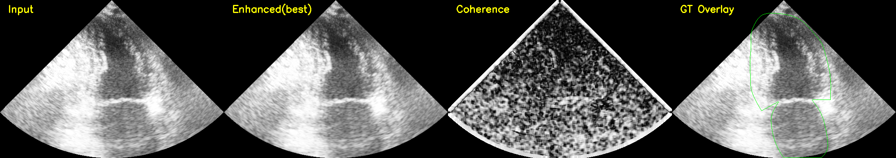

# Ultrasound-Speckle-Suppression-with-Structure-Preservation-and-Auto-Tuning
Ultrasound enhancement lab for CAMUS NII/GT: log-domain speckle suppression, structure-aware detail preservation, and automatic grid search to balance CNR, ENL, and edge ratio. Includes reproducible evaluation, visualization panels, best-parameter export, and deployment-friendly modular Python code.
**Ultrasound image enhancement with speckle suppression + structure preservation + auto grid search**

## Why this repo
This project targets a practical trade-off in ultrasound enhancement:
- suppress speckle noise (ENL↑)
- preserve anatomy boundaries (Edge ratio ~ 1.0)
- keep lesion/region contrast (CNR non-decreasing)

## Features
- NII / NII.GZ + GT loading (SimpleITK)
- Multiplicative speckle handling in log-domain
- Lee filtering + structure-guided detail reinjection
- Automatic grid search for balanced parameters
- Case-wise metrics: CNR, ENL, Edge ratio
- Export: compare panels + CSV + best params
## 📊 CAMUS Pilot Results (2 Cases)

> Setting: Best parameters selected by automatic grid search.  
> Goal: balance speckle suppression (ENL↑), contrast preservation (CNR≈), and structure preservation (Edge ratio≈1).

| Case | CNR Before | CNR After | ΔCNR | ENL Before | ENL After | ΔENL | Edge Before | Edge After | Edge Ratio |
|:--|--:|--:|--:|--:|--:|--:|--:|--:|--:|
| patient0001_2CH_ED.nii.gz | 0.4391 | 0.4386 | -0.0005 | 4.1635 | 4.1774 | +0.0139 | 41.4488 | 38.2169 | 0.9220 |
| 2patient0001_2CH_ES.nii.gz | 0.5510 | 0.5511 | +0.0001 | 6.0915 | 6.1282 | +0.0367 | 45.4278 | 41.9803 | 0.9241 |
| **Mean** | **0.4950** | **0.4949** | **-0.0002** | **5.1275** | **5.1528** | **+0.0253** | **43.4383** | **40.0986** | **0.9231** |

### Interpretation
- **CNR** is nearly unchanged (contrast preserved).
- **ENL** increases on both cases (effective speckle suppression).
- **Edge ratio ≈ 0.92** indicates mild edge attenuation but still within acceptable range for denoise-structure tradeoff.
- Overall, this pilot result demonstrates a **balanced enhancement strategy** suitable for further scaling on larger cohorts.

## 🖼️ Visual Results (Best Parameters)

### Case 1


### Case 2


## Quick Start
```bash
pip install -r requirements.txt
python scripts/run_grid_search.py
# Data Folder

This folder is intentionally empty in git.
Please place your local test data here if needed.

Expected formats:
- *.nii / *.nii.gz (ultrasound images)
- *.gt.nii / *.gt.nii.gz (ground truth masks)

⚠️ Do not commit patient data.
